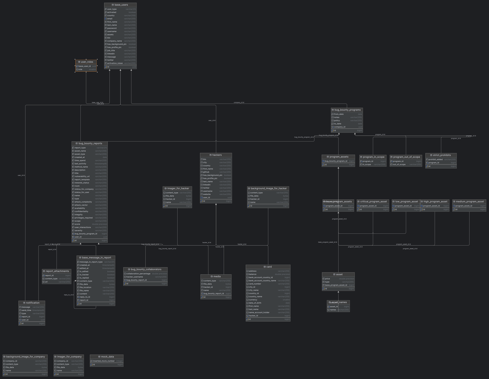

# TuringSec App in Progress

## Overview
This project aims to facilitate communication between Companies and Hackers. 
In this app there are 3 roles `(HACKER, COMPANY, ADMIN)`. 
They can send reports if any bugs are detected. Every company can send programs for hiring hackers, etc. The app is in progress...(There will be more features )

> [!IMPORTANT]
> Register and login pages for company and hackers, company registers and messages sent to admins if they approve, they sent to generated password to company via mail.

> [!NOTE]
> In every push to this project automatically build and extract jar then it deploys spring-boot-container into my public docker repository. Only pulling this container and setting up proper configuration you can easily use this app, send requests. This defined in ci.yml.  
In every request I send 2 images, one updates latest version, the other one specifies image version based on git commit. You can use latest verson of this image with only pulling ->` docker pull kamil571/turingsec_spring_boot:latest `
  I configured swagger in 5000 port you can test this project in your local machine.

## Key Features

- **Role-based security** with JWT for user authentication and authorization.
- **Real-time messaging** via WebSockets (STOMP) for instant communication.
- **Bug report system** with file uploads for reporting and tracking issues.
- **REST API** with Swagger for easy integration.
- **CI/CD pipeline**: GitHub Actions for automated builds and Docker image deployment.
- **Dual Docker image tagging**: `latest` and versioned by Git commit for better release management.
- **Email notifications** via `javax.mail` for automated alerts and updates.
- **PostgreSQL and H2 databases** for robust data storage and in-memory testing.
- **Deployed on AWS EC2 and RDS** for scalable and reliable cloud infrastructure.
- **Version control and rollback**: Easily manage code and database migrations.
- **Automated error handling** and logging for better system maintenance.
- **Real-time bug bounty updates** via WebSocket notifications for companies and users.
- **File storage** for bug report attachments and user data.
- **Multi-user support** with role-specific functionalities and permissions.
- **Bug bounty report review**: Companies can accept or reject submitted reports.
- **Company and user management** for profile updates and account settings.
- **Localized data services** for retrieving country and city information via external APIs.

### Tech Stack:

- Java
- Spring Boot
- Spring Security
- Spring Data JPA
- Websocket(STOMP)
- Docker -> For local development
- AWS(ec2,rds) -> For api deploy
- H2, Postgres
- CI
- Maven
- Mapstruct
- javax.mail
- JWT, etc.

### Entity Relationship Diagram:

## Controllers

### AdminController
- **Approve company registration**: Admins can approve company registrations and generate passwords.
- **Login**: Admins can log in using their credentials (via JWT-based authentication).

### BaseUserController
- **Get current user**: Fetch the currently authenticated user's details.
- **Get user by ID**: Retrieve the details of a user by their unique ID.
- **Delete current user**: Delete the currently authenticated user's account.

### CardController
- **Get all cards**: Retrieve all user cards.
- **Get card by ID**: Fetch a specific card by its ID.
- **Add card**: Allow users to add a new card.
- **Delete card**: Remove a card from the system.

### CompanyController
- **Register company**: Allows companies to register for approval by an admin.
- **Login**: Companies can log in with their credentials.
- **Get all companies**: Retrieve a list of all registered companies.
- **Update profile**: Companies can update their profile details.
- **Change password/email**: Allows companies to change their account credentials.
- **Close account**: Companies can delete their account.

### LocationController
- **Get countries**: Fetch a list of all countries using an external location service.
- **Get cities by country**: Retrieve cities within a given country based on its ISO2 code.

### MessageInReportController
- **Get all messages**: Retrieve messages for a specific report room.
- **Get message by ID**: Fetch a specific message by its ID.
- **Get messages by report ID**: Retrieve messages related to a particular report.

### NotificationController
- **Get notifications**: Fetch a list of notifications for the current user.

### ProgramController
- **Get company bug bounty programs**: Retrieve all bug bounty programs belonging to a company.
- **Create bug bounty program**: Allows the creation of new bug bounty programs.
- **Get all assets**: Retrieve assets associated with a specific bug bounty program.
- **Delete bug bounty program**: Remove a bug bounty program from the system.

### ReportController
- **Review bug bounty report**: Allows a company to review a bug bounty report.
- **Accept/Reject report**: Companies can accept or reject bug bounty reports.
- **Get bug bounty report by ID**: Fetch a specific bug bounty report by its ID.
- **Submit bug bounty report (manual or CVSS)**: Allows users to submit reports manually or with CVSS scoring.
- **Get reports by user/company**: Retrieve reports associated with a specific user or company.
- **Get reports within date range**: Fetch reports that fall within a specified date range.

### SSEController
- **Send SSE (Server-Sent Events)**: Provides real-time notifications to clients via SSE for instant updates.

